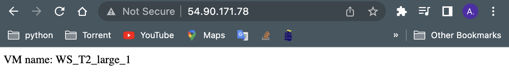

## Assignmnet 1 : Cluster Benchmarking using EC2 Virtual Machines and Elastic Load Balancer (ELB)

[](https://choosealicense.com/licenses/mit/)

#### Inctance Information:


| #  | Type       | Name       | IPv4 Public IP | Security group name | OS     | Availability zone | Cluster    | Target Group   |
| :- | :--------- | :--------- | :------------- | :------------------ |:------ | :---------------- | :--------- | :------------- |
| 1. | `M4-large` | M4-large-1 | 44.203.190.208 |      ALB_SG_M       | Ubuntu |     us-east-1a    | Cluster M  | Target-Group-M |
| 2. | `M4-large` | M4-large-2 | 44.211.161.152 |      ALB_SG_M       | Ubuntu |     us-east-1b    | Cluster M  | Target-Group-M |
| 3. | `M4-large` | M4-large-3 | 44.202.101.227 |      ALB_SG_M       | Ubuntu |     us-east-1c    | Cluster M  | Target-Group-M |
| 4. | `M4-large` | M4-large-4 | 18.233.225.20  |      ALB_SG_M       | Ubuntu |     us-east-1d    | Cluster M  | Target-Group-M |
| 5. | `T2-large` | T2-large-1 | 100.26.134.242 |      ALB_SG_T       | Ubuntu |     us-east-1a    | Cluster T  | Target-Group-T |
| 6. | `T2-large` | T2-large-2 | 34.227.58.149  |      ALB_SG_T       | Ubuntu |     us-east-1b    | Cluster T  | Target-Group-T |
| 7. | `T2-large` | T2-large-3 | 54.242.110.108 |      ALB_SG_T       | Ubuntu |     us-east-1c    | Cluster T  | Target-Group-T |
| 8. | `T2-large` | T2-large-4 | 54.89.60.191   |      ALB_SG_T       | Ubuntu |     us-east-1d    | Cluster T  | Target-Group-T |
| 9. | `T2-large` | T2-large-5 | 3.94.79.209    |      ALB_SG_T       | Ubuntu |     us-east-1e    | Cluster T  | Target-Group-T |


#### SSH Access
  To access the VMs:

  - Download `labsusers.pem` (Certificate file) and change your directory to that downlowded file.
  
  - Change the permission of the file.
  ```console
  $ chmod 400 labsuser.pem
  ```
  
  - To access into each VM run the below command based on especific VM IPv4:
  ```console
  $ ssh -i labsusers.pem ubuntu@<public-ip>
  ```

#### Setup Instances

To install the flask webserver for each VM, please follow the below instruction.

```console
#!/bin/bash
# Install necessary files and run Flask in the back ground 

sudo apt update
mkdir flask_application && cd flask_application
sudo apt install python3-pip python3-flask -y

INSTANCE_NAME='Amin'

echo "from flask import Flask
app = Flask(__name__)

@app.route('/')
def hello():
    return 'VM name: $INSTANCE_NAME'

if __name__ == '__main__':
    app.run(host='0.0.0.0', port=80, debug=True)" > my_app.py

nohup sudo python3 my_app.py &
```

##### Setup Outcome





#### Setup ALB [!](https://www.youtube.com/watch?v=0XMsnAgHXoo&ab_channel=TinyTechnicalTutorials)
[](ALB.mov)
